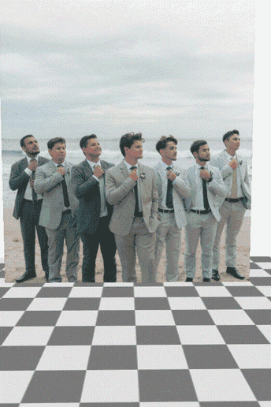

<p align="center">
  <h1 align="center">Multi-HMR 2: Multi-Person Camera-Centric Human Detection, Mesh Recovery and Tracking</h1>

  <p align="center">
    <a href="https://g-fiche.github.io/">Guénolé Fiche</a>, 
    <a href="https://philippeweinzaepfel.github.io/">Philippe Weinzaepfel</a>, 
    <a href="https://rbregier.github.io/">Romain Brégier</a>,
   <a href="https://fabienbaradel.github.io/">Fabien Baradel</a>
  </p>

  <p align="center">
  <a href="https://arxiv.org/abs/2606.14841"></a>
  <a href="https://arxiv.org/pdf/2606.14841.pdf"></a>
  <a href="https://europe.naverlabs.com/"></a>
  <a href="https://multi-hmr-2-demo.europe.naverlabs.com/"></a>
  </p>

  <div align="center">
  
  &nbsp;&nbsp;&nbsp;
  

  <br>
  Multi-HMR 2 detects humans and recovers their 3D meshes, placed in the scene, along with camera parameters. 
  It also outputs per-human features that allow online tracking in videos, despite being trained only on still images.
  <br>

  </div>

</p>


## Installation

```bash
mamba create -n multihmr2 python=3.10 -y
pip install -e .          # core inference only
pip install -e .[render]  # add this if you want to render or save meshes
```

**Note:** Anny parses MakeHuman assets and caches pre-computed blend shape data to avoid recomputation on subsequent runs. The first instantiation of a model in a new environement can take a few minutes.

## Usage

**Checkpoint:** We provide the pretrained **Multi-HMR 2.b** model as introduced in the paper. The model weights are downloaded automatically the first time you run inference. If the file passed to `--checkpoint` (e.g. `checkpoints/multihmr2.pt`) does not exist, the parent directory is created and the checkpoint is fetched from `https://download.europe.naverlabs.com/ComputerVision/MultiHMR/multihmr2.pt`. The path must be named `multihmr2.pt`.

### Command line

Image:
```bash
multihmr2 --checkpoint checkpoints/multihmr2.pt \
             --image demo_data/sample_image.jpg \
             --out output --save_mesh --render
```

Video:
```bash
multihmr2 --checkpoint checkpoints/multihmr2.pt \
             --video demo_data/sample_video.mp4 \
             --out output --save_anny_params --render
```

**Required:** `--checkpoint`, `--out`, and exactly one of `--image` / `--video`.

**Output flags** (none on by default):
- `--save_mesh` - export per-person meshes as `.glb` files.
- `--save_anny_params` - export pose & shape parameters as `.pkl` files.
- `--render` - render the predicted meshes overlaid on the image. Rendering is slow (offscreen OpenGL via PyRender, ~100–200 ms per frame), so expect several minutes for a typical video clip.

**Rendering backend:** the OpenGL backend is selected automatically — if an EGL-capable device is detected, the GPU-accelerated **egl** backend is used; otherwise rendering falls back to the CPU-based **osmesa** backend (slower, but works everywhere). To force a specific backend, set the environment variable before running, e.g. `export PYOPENGL_PLATFORM=osmesa` (or `egl`).

**Tuning:**
- `--conf_thresh` (default `0.4`) - minimum confidence to keep a detection.
- `--dist_thresh_nms` (default `0.25`) - pelvis-distance threshold (meters) for 3D NMS.
- `--lowres` - use the low-resolution Anny body model (613 vertices instead of ~10k).
- `--framerate` (default `30`) - framerate of the rendered video.
- `--tmp_dir` - directory where video frames are extracted (defaults to `<out>/_frames_tmp`).

**Performance:**
- `--compile` - compile the encoder and HPH decoder with `torch.compile` for faster inference. 

**Note:** The first call is slow (~5–30 s) while kernels are compiled, and recompilation is triggered again whenever the image resolution changes. This flag is only beneficial when processing a large number of images that share the same resolution (e.g. all frames of a video, or a batch of same-size images).

### Python API

Image:
```python
from multihmr2 import init_hmr_session, infer_image, render_results_image

sess = init_hmr_session("checkpoints/multihmr2.pt")
pred = infer_image(sess, "demo_data/sample_image.jpg")
render_results_image(sess, pred, "demo_data/sample_image.jpg", "output")
```

Video (with cross-frame tracking):
```python
from multihmr2 import init_hmr_session, infer_video, render_results_video

# Pass compile_model=True when processing many frames at a fixed resolution.
sess = init_hmr_session("checkpoints/multihmr2.pt", compile_model=True)
preds = infer_video(sess, "demo_data/sample_video.mp4", tmp_dir="tmp")
render_results_video(sess, preds, out_dir="output", tmp_dir="tmp")
```

For programmatic access to predictions, see `DecoderOutput` and `PersonOutput`
(joints, vertices, pose, shape, track IDs, …) exposed at the top level of
`multihmr2`.

## Related projects

- [Anny](https://github.com/naver/anny) - a unified and interpretable parametric model, available under Apache 2.0 license, that covers the full human lifespan – from infants to the elderly.
- [Anny-One](https://europe.naverlabs.com/research/vision-foundation-models-for-human-understanding/anny-one/) - a synthetic dataset of 780K+ multi-person and multi-view images with Anny ground-truth meshes.
- [Anny-Fit](https://github.com/naver/anny-fit) - a multi-person, camera-space optimization framework for all-age 3D human mesh recovery that can be used to produce pseudo-ground truth annotations in the Anny format.

## Citation
If you find our paper or code useful you can cite our work with:
```
@misc{multihmr2-2026,
    title={{Multi-HMR 2}: Multi-Person Camera-Centric Human Detection, Mesh Recovery and Tracking},
    author={Fiche, Gu{\'e}nol{\'e} and Weinzaepfel, Philippe and Br{\'e}gier, Romain and Baradel, Fabien},
    year={2026},
    eprint={2606.14841},
    archivePrefix={arXiv},
    primaryClass={cs.CV},
    url={https://arxiv.org/abs/2606.14841}, 
}
```
